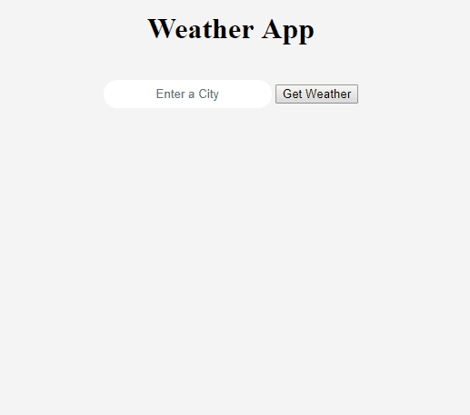

# Weather App



# Built with NodeJS, Express and the EJS templating language

Using the Fecth API, I get from the OpenWeatherMap API an object which I store locally. Then I display the data in the browser by using ExpressJS and the EJS templating language. It would have been easier to do everything using ReactJS but the goal was to learn as much as possible on NodeJS.
What’s next ? :  The user’s search will be saved to a Database (MongoDB) and displayed as history on the website.  

## Getting Started

These instructions will get you a copy of the project up and running on your local machine.

### Prerequisites

You need to have NodeJS installed and up to date.

### Installing

Download the repository on the Github page or clone it in the terminal:

```
git clone https://github.com/epaumier/weatherapp weatherapp

```

Go to the root of the folder

```
cd /weatherapp

```

Install all the required packages

```
npm install

```

Start the app


```
npm start

```

Open your web browser to localhost:3000 and give it a try.
